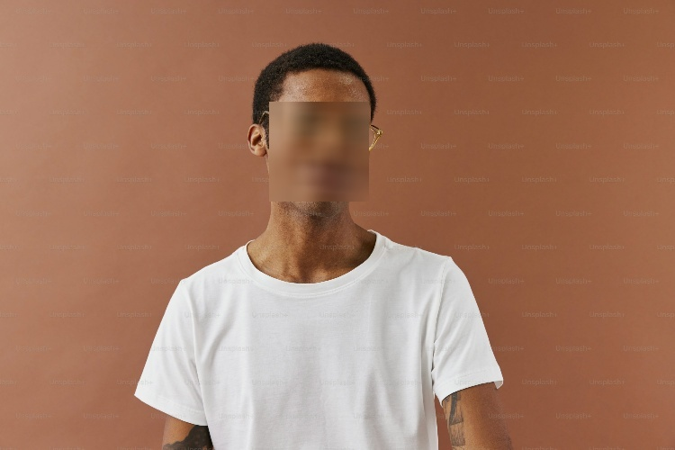

# Face Anonymizer using OpenCV & MediaPipe

This project detects human faces in **images, videos, or live webcam feed** and automatically **blurs the detected faces** using **OpenCV** and **MediaPipe Face Detection**.

It is useful for **privacy protection**, **anonymization**, and **computer vision learning projects**.

---

## Features

- Face detection using **MediaPipe**
- Face blurring using **OpenCV**
- Supports:
  - Image files
  - Video files
  - Live webcam
- Beginner-friendly Python code
- No model training required

---

## Technologies Used

- Python 3.10
- OpenCV
- MediaPipe

---


## 🚀 Installation and Usage

#### Setting up virtual environment

```bash 
python -m venv venv
venv\Scripts\Activate.ps1
venv\Scripts\activate
```

#### Installing Libraries
``` bash
pip install opencv-python mediapipe
```

## 🖥️ Running the Application
``` bash
python main.py
```

## 📝 Code Usage and Output
Code detects color in real time
Images are just used to display its efficiency
#### Input vs Output

| Input | Output |
|------|--------|
|  |  |

**Input Image Path:** `image/face.jpg`  
**Output Image Path:** `image/out.jpg`

#### Input vs Output Video

| Input | Output |
|------|--------|
| [▶️ test.mp4](video/test.mp4) | [▶️ out.mp4](video/out.mp4) |
